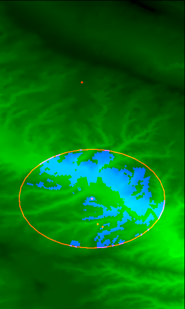
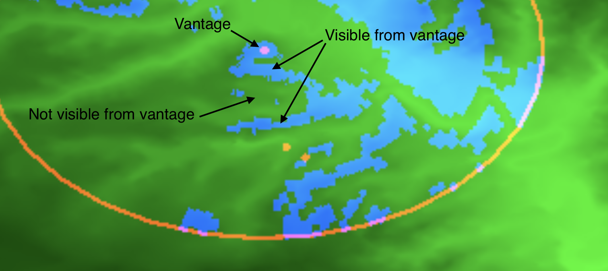
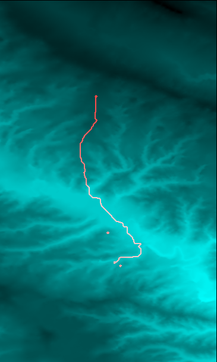

# PostGIS Exploration

In this repository I have used PostGIS to implement two pieces of functionality I found myself
wishing were features in the OnX app during this past hunting season.
Specifically, these features were:

* Highlighting on a topo map the region that should be visible from my current location, and
* Routing along a least-effort path between two points through entirely off-trail terrain 

As a demonstration, I have produced outputs using real locations in the area where I
harvested a mule deer doe on November 19th, 2022.

**Note 1: The intent of this repository was to attempt to implement these features
*specifically using PostGIS* as a way of familiarizing myself with PostGIS. If one wanted
to actually implement these features in a mobile app, it would almost certainly be best to do so
client-side. Moreover, in both cases, there are alternative approaches that would achieve significantly
better performance (in particular, using the GPU for line-of-sight computations would 
likely be near-instantaneous).**

Because my goal was just to get an initial handle on PostGIS — and I do believe these "exercises"
helped me achieve that goal — I was more concerned with implementing these features specifically with
PostGIS than with optimizing the implementation in any way.

**Note 2: I have only tested this implementation on my MacOS laptop.**

## Features

### Visibility region highlighting

In this image: 

* Brighter green indicates lower elevation
  * Apparently `ST_AsPNG(ST_ColorMap(...))`
  converted lower elevations to brighter pixel values. 
* The large oval actually represents a 1km-diameter circle in which the visiblity region has been computed.
  * (The ovalness of this circle is due to distortion in the projection.)
* The blue sections are the result of the visibility-region computation implemented in
  [sql/line_of_sight/line_of_sight.sql](sql/line_of_sight/line_of_sight.sql).
* The red dot at the center of the large circle represents the location from which I spotted the deer.
* The bottom-right-most red dot represents the approximate location of the deer when I first spotted it.

(The other red dots in the image represent the location of my vehicle, and the location of the deer where I 
retrieved it, relevant to the section on routing below.)

**Context:**

When I first spotted the deer, I only saw two ridges between where I was and where they were.
However, during the stalk, I ended up briefly confused by the presence of a third ridge between myself and the deer.
While I didn't confirm this in the field, I suspected that one of the ridges was hidden from my vantage point,
and I was excited to confirm this while working on this PostGIS-learning project.

I have included implementation details [below](#implementation-visibility-region-highlighting).

### Least-effort routing

In this image:

* Brighter values of cyan represent lower elevations (I mapped elevation into both the blue and green channels here)
* The red path represents a heuristic "least effort" path routing from the location where I retrieved the
deer back to where our vehicle was parked.
  * This implementation used to compute this path is in [sql/routing/routing.sql](sql/routing/routing.sql). 

**Context:**
While packing out, because we didn't have good visibility up the dried creek bed and weren't sure whether 
we'd be forced on a highly-meandering path; we ended up making the mistake of crossing the dried creek bed
right away, and were forced to cross the various deep gullies that ran perpendicular to our path back to where
we parked.

I was also excited to see that the route produced by this algorithm did *not* make this mistake, and followed
a route that would have been significantly lower effort.

I have included implementation details [below](#implementation-least-effort-routing).

-----

## Setup

To reproduce these results locally, you should only need to have recent versions of `psql` and `docker` installed.

You'll also need to use `git lfs` to retrieve the raw data used to produce these results. After cloning the repository,
you just need to run 

    git lfs install
    git lfs pull

to retrieve the raw data file (`data/load_elevation_raster.sql.gz`).

Once you have retrieved this data file, running the following commands should reproduce the images shown above:

    docker compose build
    docker compose up -d
    sleep 30  # wait for the database to start accepting connections
    gunzip --keep data/load_elevation_raster.sql.gz
    ./scripts/psql.sh -f data/load_elevation_raster.sql
    ./scripts/rebuild_all.sh

I have included more detail about the setup and these commands below.

### Docker Compose

For ease of reproducibility, I used `docker compose` to set up a Postgres server with the appropriate
PostGIS extensions installed. I also added the pgRouting extension for the routing feature implementation.
The docker setup for the postgres container is in [`services/database`](services/database).

With a recent version of docker installed locally, you can build then start this service via:

    docker compose build
    docker compose up -d

### Retrieving the source data

I retrieved the digital elevation model data used for this implementation
[from the USGS](https://apps.nationalmap.gov/lidar-explorer/#/).

In particular, I used the 1/3 arc-second data in the 1°⨉1° region between 47°N and 48°N, and between 108°W and 109°W.
Retrieving this file from the link above provided me with USGS_13_n48w109_20130911.tif. In order to load this
data into postgres, I needed to install the utility `raster2pgsql`, which was provided with the Postgis homebrew
formula:

    brew install postgis 

I then converted this .tif file into a sql file I could run to load the data into my postgres instance via: 

    raster2pgsql -t 512x512 -I -C -M \
      data/USGS_13_n48w109_20130911.tif \
      public.raw_elevation \
      >data/load_elevation_raster.sql

    ./scripts/psql.sh -f data/load_elevation_raster.sql

(Note that the [scripts/psql.sh](scripts/psql.sh) script will connect to the `docker compose`-managed 
postgres while it is running.)

In order to reduce the number of local dependencies, rather than committing the source .tif file I retrieved,
I have committed the (gzipped) output of the raster2pgsql command. From a fresh clone of this repository,
you can load the data by first starting the database service, waiting for it to come online (on first launch,
it takes a little time to configure the relevant extensions), then running:

    gunzip --keep data/load_elevation_raster.sql.gz
    ./scripts/psql.sh -f data/load_elevation_raster.sql

This populates the table `public.raw_elevation` with 512x512 rasters containing the full elevation data for this
1°⨉1° region.

### Producing the outputs

Once the data has been loaded, you can regenerate the images shown above by running the
[scripts/rebuild_all.sh](scripts/rebuild_all.sh) script.

(As noted above, I have only attempted to run this script on my local laptop;
it may have portability surprises on other platforms.)

Note that this script will take a few minutes to run.
(There is some room for optimization 🙂).

-----

## Implementation details

#### Common

In [`sql/common`](sql/common) there are various SQL queries that create tables used in one or both of these
applications. The produced tables essentially serve as a cache of a filtered subset of the data relevant to
the queries. In more detail:

* [`01_parameters.sql`](sql/common/01_parameters.sql) defines some parameter values that I experimented with during development
* [`02_labeled_points.sql`](sql/common/02_labeled_points.sql) creates a table with the labeled locations I extracted from my OnX waypoints
* [`11_area_elevation.sql`](sql/common/11_area_elevation.sql) produces a single "filtered" raster tile containing a filtered area encompassing
  the points stored in `02_labeled_points.sql`.
* [`12_area_attributes.sql`](sql/common/12_area_attributes.sql) augments the raster produced in `11_area_elevation.sql` with slope and aspect data.
  (The slope is used in the routing application; the aspect was ultimately not used.)
* [`13_area_points.sql`](sql/common/13_area_points.sql) creates a table with one row per raster point that I found useful while producing the
  routing graph (though I think it could be eliminated).

#### Implementation: Visibility region highlighting

I implemented this by sampling elevation values every 31 meters out to a 1-kilometer distance from the source point
along bearings every 2 degrees from 0° to 360°. I then computed the pitch of the rays along each bearing, and filtered
out any target points where the ray between the source and the target had a pitch that was smaller than that of another
point along the same ray but at a closer distance, as this would indicate that the surface was obstructed from view by 
the closer point.

I then computed the Voronoi diagram for all the sampled points using 
[ST_VoronoiPolygons](https://postgis.net/docs/ST_VoronoiPolygons.html), and filled in the polygons within that diagram
that contained the points unfiltered in the step above.

This logic is contained in [sql/line_of_sight/line_of_sight.sql](sql/line_of_sight/line_of_sight.sql).

#### Implementation: Least-effort routing

I implemented this using the pgRouting extension to compute a least-cost path in a graph representing possible
traversals of the terrain.

In particular, within a neighborhood of the start and destination points, I built a graph where the vertices
corresponded to the pixels of the elevation raster, and the edges were produced by connecting neighboring raster pixels
(including along diagonals) with a cost that was a function of the elevation data in the vicinity of the two pixels.

In particular, the edge-cost formula I used was the sum of three terms:

* The distance between the points represented by the two pixels
* The absolute value of the change in elevation multiplied by a parameter I called `dz_cost_scale`
  * Using `dz_cost_scale == 50` produced a reasonable path; I didn't do much tuning
* The distance between the points multiplied by the tangent of the average slope at the two points
  * Note that this is absolute magnitude of the slope of the surface at each point, regardless of the direction.
  In particular, this is **not** the slope of the path between the two points, which is captured in the previous term
  * This was meant to capture the increase in difficulty of traversal that comes from side-hilling
  * While I had some geometric justification for this formula, ultimately it was
  just a heuristic that did a good job of pushing the solution toward following ridges and other more level paths

From there, I just computde the shortest path via the pgr_bdDijkstra function from pgRouting (an implementation of
bidirectional Dijkstra's algorithm for computing the shortest path in the graph.) 

This logic is contained in [sql/routing/routing.sql](sql/routing/routing.sql).
